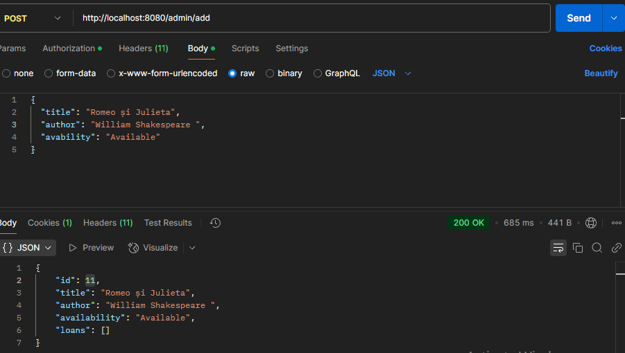
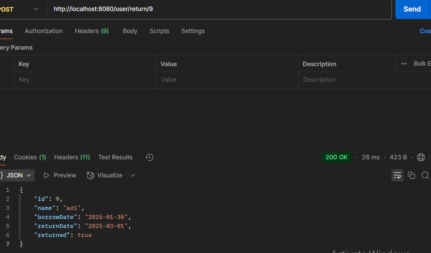
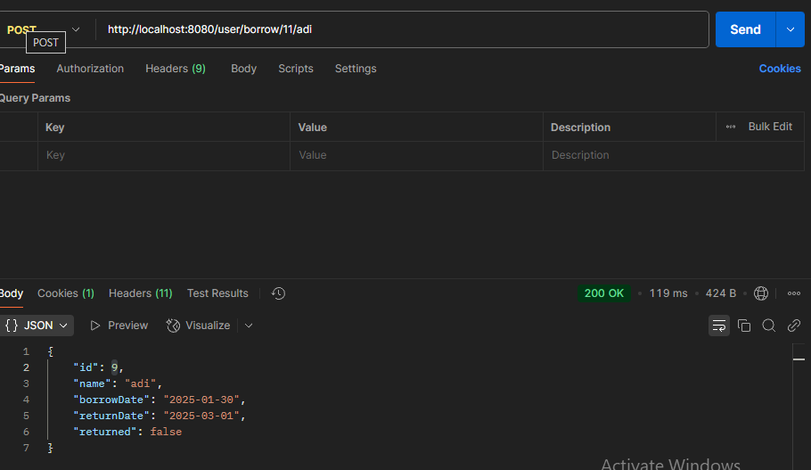

# Library Management Spring Boot Project 📚

## Project Description

Welcome to the Library Management Spring Boot Project repository! This project is designed to manage a library system, allowing administrators and users to manage books and loans. Built with Java Spring Boot, JPA, Hibernate, Lombok, and MySQL, this project provides functionality to add, update, borrow, return, and delete books and loans.

Are you looking for an efficient solution to manage books, users, and loans? This project is perfect for small to large library systems and can be easily extended to fit additional needs.

## Features
- 📝 **Create, update, and delete books** with detailed descriptions and availability status
- 👤 **Borrow and return books** with tracking of loan status
- 🗂️ **Manage loans**, including return dates and overdue tracking
- 🔒 **User authentication and authorization** with role-based access for admins and users
- 🔐 **BCrypt password encoding** for secure user password storage
- 🧑‍💻 **Role-based authorization**: Different access levels for admins and users
- 📑 **Logging**: Application logs for better monitoring and troubleshooting

## Technologies Used
- Java 17
- Spring Boot
- Spring Data JPA
- MySQL
- Hibernate
- Lombok
- Spring Security
- BCrypt
- SLF4J with Logback (for logging)
- JSON (for API communication)

## Setup Instructions
To launch the project, follow the steps below:

1. **Clone the repository** to your local machine:
   ```bash
   git clone https://github.com/PopescuAdrianIulian/Library-Management-System.git
   ```

2. **Import the project** into your favorite Java IDE (e.g., IntelliJ IDEA or Eclipse).

3. **Configure MySQL Database Connection**:
   - Set up a MySQL database and create a schema for the project.
   - Update the `application.properties` file with your database credentials:
     ```properties
     spring.datasource.url=jdbc:mysql://localhost:3306/your_database_name
     spring.datasource.username=your_username
     spring.datasource.password=your_password
     spring.jpa.hibernate.ddl-auto=update
     spring.jpa.show-sql=true
     ```

4. **Run the Project**:
   You can run the application via your IDE or use the following command in your terminal:
   ```bash
   mvn spring-boot:run
   ```

5. **Start exploring the Library Management System!**

## API Endpoints

The application exposes the following endpoints:

### Admin Endpoints (Protected with Admin Role)
- **POST /admin/add**: Add a new book to the library
  - Request Body Example:
    ```json
    {
      "title": "Spring Boot for Beginners",
      "author": "John Doe",
      "availability": "AVAILABLE"
    }
    ```

- **PUT /admin/{id}**: Update an existing book by ID
  - Request Body Example:
    ```json
    {
      "title": "Spring Boot Advanced",
      "author": "Jane Doe",
      "availability": "AVAILABLE"
    }
    ```

- **DELETE /admin/book/{id}**: Delete a book by ID

- **DELETE /admin/loan/{id}**: Delete a loan by ID

### User Endpoints (Accessible by Users)
- **GET /user/list**: Get a list of all available books

- **POST /user/borrow/{bookId}/{name}**: Borrow a book by ID and user name
  - Example URL: `/user/borrow/1/John`

- **POST /user/return/{loanId}**: Return a borrowed book by loan ID

- **GET /user/loans/{loanId}**: Get loan details by loan ID

- **GET /user/loans/list**: Get a list of all loans

## Security Features

### Role-Based Authorization
- The application uses role-based authorization with two main roles:
  - **USER**: Allows borrowing and returning books, viewing loans.
  - **ADMIN**: Provides additional rights to add, update, and delete books, as well as manage loans.

### BCrypt Password Encoding
- User passwords are encoded using **BCrypt** for secure storage. This prevents plain-text passwords from being saved in the database, ensuring a higher level of security.

### Logging
- The application uses **SLF4J** with **Logback** to log important actions such as user logins, failed attempts, and other critical system operations. This helps in monitoring and troubleshooting the application.

## Screenshots
**Screenshot 1: Book List**  


**Screenshot 2: Borrow Book**  


**Screenshot 3: Loan Details**  


## Support
If you encounter any issues or have any questions regarding the project, feel free to reach out. We are always here to help and improve the Library Management Spring Boot
